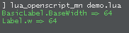
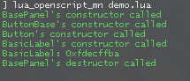

# glua-RobustClass
A flexible, performant, solid, and practical class system for GLua.

## What's the point?
We already have powerful enough Lua metatables. So, what's the purpose of it?

It serves as a tool that amplifies their functionality and streamlines the work process with them.

## Features
* Highly performant table-access concerning the object's values, its class's values, its base classes' values</br>
	&emsp; No function in <code>**[__index-metafield](https://www.lua.org/pil/13.4.1.html)**</code> is used</br>
	<details> <summary>Demo</summary>

	```lua
	local BasePanel = robustclass( 'BasePanel' )
	do

		BasePanel.BaseWidth = 64
		BasePanel.BaseHeight = 24

		function BasePanel:BasePanel()

			self.x, self.y = 0, 0
			self.w, self.h = BasePanel.BaseWidth, BasePanel.BaseHeight

		end

	end

	local ButtonBase = robustclass( 'ButtonBase : BasePanel' )
	local Button = robustclass( 'Button : ButtonBase' )

	local BasicLabel = robustclass( 'BasicLabel : Button' )

	print( Format( 'BasicLabel.BaseWidth => %s', BasicLabel.BaseWidth ) )

	local Label = BasicLabel()
	print( Format( 'Label.w => %s', Label.w ) )
	```
	
	</details>

* Recursive construction & destruction of an object</br>
	<details> <summary>Demo</summary>

	```lua
	local BasePanel = robustclass( 'BasePanel' )
	do

		function BasePanel:BasePanel() print( 'BasePanel\'s constructor called' ) end
		function BasePanel:_BasePanel() print( 'BasePanel\'s destructor called' ) end

	end

	local ButtonBase = robustclass( 'ButtonBase : BasePanel' )
	do

		function ButtonBase:ButtonBase() print( 'ButtonBase\'s constructor called' ) end

	end

	local Button = robustclass( 'Button : ButtonBase' )
	do

		function Button:Button() print( 'Button\'s constructor called' ) end

	end

	local BasicLabel = robustclass( 'BasicLabel : Button' )
	do

		function BasicLabel:BasicLabel() print( 'BasicLabel\'s constructor called' ) end

	end

	local Label = BasicLabel()
	print( Label )

	robustclass.Delete( Label )
	```
	
	</details>

* Possibility of adjusting/overriding the default creation/deletion action</br>
	&emsp; See more at the docs.

* Multiple inheritance</br>
	<details> <summary>Demo</summary>

	```lua
	local BasePanel = robustclass( 'BasePanel' )
	do

		BasePanel.BaseWidth = 64
		BasePanel.BaseHeight = 24

		function BasePanel:BasePanel()

			self.x, self.y = 0, 0
			self.w, self.h = BasePanel.BaseWidth, BasePanel.BaseHeight

		end

	end

	local BasicLabel = robustclass( 'BasicLabel : BasePanel' )
	do

		function BasicLabel:BasicLabel()

			self.text = 'Lorem ipsum'

		end

	end

	local ButtonBase = robustclass( 'ButtonBase : BasePanel' )
	local Button = robustclass( 'Button : ButtonBase, BasicLabel' )

	local ContextActions = robustclass( 'ContextActions' )
	do

		function ContextActions:ContextActions()

			self.Actions = {}

		end

	end

	local AdvancedLabel = robustclass( 'AdvancedLabel : BasicLabel, ButtonBase, ContextActions' )

	local pnlLabel = AdvancedLabel()
	print( pnlLabel.text, pnlLabel.Actions )
	```
	
	</details>

## Docs
Read the main documentation [here](/DOCS.md)
