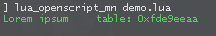

# glua-RobustClass
A flexible, performant, solid, and practical class system for GLua.

## What's the point?
We already have powerful enough Lua metatables. So, what's the purpose of it?

It serves as a tool that amplifies their functionality and streamlines the work process with them.

## Features
* Highly performant table-access concerning the object's values, its class's values, its base classes' values</br>
	&emsp; No function in <code>**[__index-metafield](https://www.lua.org/pil/13.4.1.html)**</code> is used</br>
	<details> <summary>Demo</summary>

	```lua
	local A = robustclass( 'A' )
	A.test = 'Hello World!'

	local B = robustclass( 'B : A' )
	local C = robustclass( 'C : B' )
	local D = robustclass( 'D : C' )

	print( Format( 'D.test => %s', D.test ) )

	local objD = D()
	print( Format( 'objD.test => %s', objD.test ) )
	```
	
	</details>

* Recursive construction & deconstruction of an object</br>
	<details> <summary>Demo</summary>

	```lua
	local A = robustclass( 'A' )
	do

		function A:A()

			self.phi = 1.618
			print( 'A\'s constructor called' )

		end

	end

	local B = robustclass( 'B : A' )
	do

		function B:_B() print( 'B\'s destructor called' ) end

	end

	local C = robustclass( 'C : B' )
	do

		function C:C() print( 'C\'s constructor called' ) end

	end

	local D = robustclass( 'D : C' )
	do

		function D:D()

			print( 'D\'s constructor called' )

		end

	end

	local objD = D()
	print( 'phi ~ ' .. objD.phi )

	robustclass.Delete( objD )
	```
	
	</details>

* Possibility of adjusting/overriding the default creation/deletion action</br>
	&emsp; See more at the docs.

* Multiple inheritance</br>
	<details> <summary>Demo</summary>

	```lua
	local A = robustclass( 'A' )
	do

		AccessorFunc( A, 'x', 'X' )
		AccessorFunc( A, 'y', 'Y' )

		function A:A() print( 'A\'s constructor called' ) end

	end

	local B = robustclass( 'B' )
	do

		function B:B() print( 'B\'s constructor called' ) end

	end

	local C = robustclass( 'C' )
	do

		function C:C() print( 'C\'s constructor called' ) end

	end

	local D = robustclass( 'D : C, B, A' )
	do

		function D:D()

			print( 'D\'s constructor called' )

			self:SetX( 4 )
			self:SetY( 0 )

		end

	end

	local objD = D()
	print( objD:GetX(), objD:GetY() )
	```
	
	</details>

## Docs
Read the main documentation [here](/DOCS.md)
